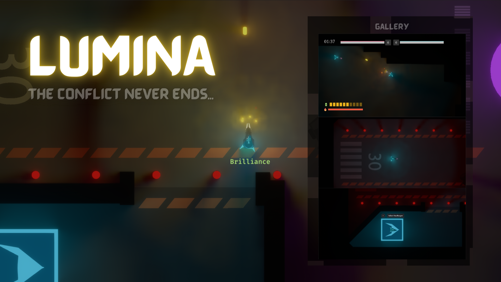

# Lumina

A top down, fast paced, objective based, PvP game.



## Quickstart

If you just want to play the game, go to [this section](#playing-the-game)!

To compile Lumina, you have to perform a recursive clone:

```
git clone --recursive https://github.com/nixon-voxell/lumina.git
```

### Run the game

Before running the game, the `assets` folder needs to be linked correctly to all the binary crates.
You can do so by running:

```
create_asset_junctions.bat
```

To run the game, you need to start the server and the client.
You can do so manually using:

```
cargo run --bin lumina_server
cargo run --bin lumina_client
```

For development purposes, a shell script has been created to speed things up:

#### Windows

```
run.bat x
```

With `x` being the number of clients you want to spawn.

## Tech Stack

Lumina is made mainly using the Rust language.
This means that most of the dependencies used will also be from the Rust ecosystem.

Here is the breakdown of the Lumina tech stack:

| Component           | Tool/Library                                                                                             |
|---------------------|----------------------------------------------------------------------------------------------------------|
| Game Engine         | [Bevy](https://bevyengine.org/)                                                                          |
| UI/UX               | [Velyst](https://github.com/voxell-tech/velyst)                                                          |
| Global Illumination | Radiance Cascades, an improvement from [here](https://github.com/nixon-voxell/bevy_radiance_cascades)    |
| Particle System     | [Bevy Enoki](https://github.com/Lommix/bevy_enoki)                                                       |
| Physics             | [Avian](https://github.com/Jondolf/avian)                                                                |
| Networking          | [Lightyear](https://github.com/cBournhonesque/lightyear)                                                 |
| Asset Management    | [Blenvy](https://github.com/kaosat-dev/Blenvy)                                                           |
| Input Manager       | [Leafwing Input Manager](https://github.com/Leafwing-Studios/leafwing-input-manager)                     |
| Coroutine           | [Bevy Coroutine](https://github.com/Maaxed/bevy_coroutine)                                               |
| Motion Graphics     | [Bevy MotionGfx](https://github.com/voxell-tech/bevy_motiongfx)                                          |

Lumina is unique in several ways in terms of technical challenges.
It is essentially also a technical playground in hindsight to test new tecnologies to their limits.

- Lumina uses vector graphics for all of its UI components which is rendered using [Vello](https://github.com/linebender/bevy_vello).
- Lumina's UI system is built entirely using a fairly new language called [Typst](https://typst.app/).
- Lumina employs a novel approach towards 2d lighting using a global illumination technique called Radiance Cascades.

# Playing the game!

1. Download the provided `lumina_build.zip` file from the [release page](https://github.com/nixon-voxell/lumina/releases) and extract it.
2. Once extracted, you have 2 options, either host it locally, or host it online.

## Hosting locally (single machine)

If you just want to play the game on a single machine, simply run both the `lumina_server.exe` and `lumina_client.exe`.
You can run multiple instances of `lumina_client.exe` which will act like a different player.

## Hosting on LAN (multiple machines)

To host for your entire LAN (local area network), open up terminal and determine your local IP address using `ipconfig` on Windows or `ifconfig` on Linux/Mac.

Then, copy the IP address and paste it in `assets/settings.ron` in the `server_addr` field:
```ron
    ..
    shared: SharedSettings(
        server_addr: "your ip here!",
        server_port: 5000,
        ...
    )
```
With the same IP address, paste it also in your other machines' `settings.ron` file.

Once done, run `lumina_server.exe` on the host machine (the machine where you copy the IP address).
On other machines, including the host machine, just run `lumina_client.exe`, it will automatically connect to the server.

## Hosting online

> [!WARNING]
> Hosting online risks your IP address being leaked. Continue this path with great caution!

The steps to host online is pretty similar to how you host on LAN (previous section). The only difference now is that you will need to do 2 extra things:

1. Port-forward your hosting machine on your router with the port `5000`.
2. Change the `sever_addr` field to your public IP address instead (you can check this via https://whatismyipaddress.com/).
