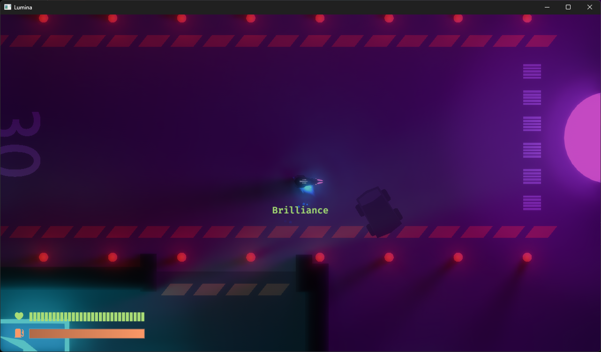

# Lumina

A top down fast paced objective based PvPvE game.



## Quickstart

To compile Lumina, you have to perform a recursive clone:

```
git clone --recursive https://github.com/nixon-voxell/lumina.git
```

### Run the game

Before running the game, the `assets` folder needs to be linked correctly to all the binary crates.
You can do so by running:

```
create_asset_junctions.bat
```

To run the game, you need to start the server and the client.
You can do so manually using:

```
cargo run --bin lumina_server
cargo run --bin lumina_client
```

For development purposes, a shell script has been created to speed things up:

#### Windows

```
run.bat x
```

With `x` being the number of clients you want to spawn.

### Test Bed

To improve development time, the `crates/test_bed/examples` folder is used to create mini test cases with minimal compilation time. Run a test example using the following command:

```
cargo run --example test_name
```

With `test_name` being the name of your testing example.


## Tech Stack

Lumina is made mainly using the Rust language.
This means that most of the dependencies used will also be from the Rust ecosystem.

Here is the breakdown of the Lumina tech stack:

| Component           | Tool/Library                                                                                             |
|---------------------|----------------------------------------------------------------------------------------------------------|
| Game Engine         | [Bevy](https://bevyengine.org/)                                                                          |
| UI/UX               | [Velyst](https://github.com/voxell-tech/velyst)                                                          |
| Global Illumination | Radiance Cascades, an improvement from [here](https://github.com/nixon-voxell/bevy_radiance_cascades)    |
| Particle System     | [Bevy Enoki](https://github.com/Lommix/bevy_enoki)                                                       |
| Physics             | [Avian](https://github.com/Jondolf/avian)                                                                |
| Networking          | [Lightyear](https://github.com/cBournhonesque/lightyear)                                                 |
| Asset Management    | [Blenvy](https://github.com/kaosat-dev/Blenvy)                                                           |
| Input Manager       | [Leafwing Input Manager](https://github.com/Leafwing-Studios/leafwing-input-manager)                     |
| Coroutine           | [Bevy Coroutine](https://github.com/Maaxed/bevy_coroutine)                                               |
